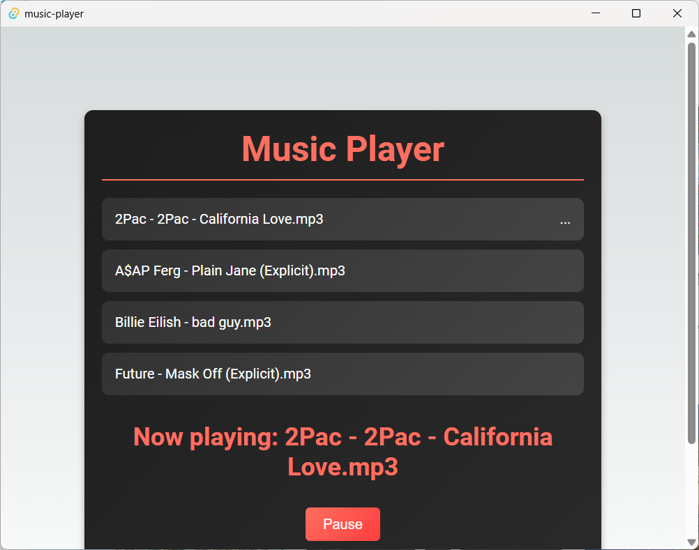

# mp3-player

From video: [(5) Music Player using Next.js + RUST | Desktop Dev | Tauri | Step by Step - YouTube](https://www.youtube.com/watch?v=ct-2-GIgL1s)

## How to run


Clone the repository

```bash
git clone https://github.com/un4gt/mp3-player.git
```

Install the dependencies

```bash
cd my-app
yarn install
```

Put some audio files to `./assets/mp3` folder

Now run

```bash
yarn tauri dev
```

